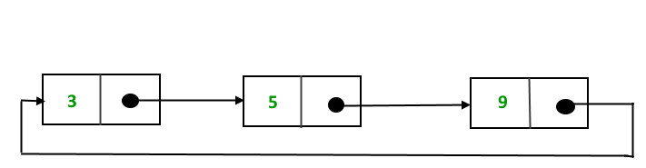

# Lista Enlazada (Linked-List)
---

## Definición: 
Una lista enlazada es una estructura de datos que consta de nodos, donde cada nodo contiene un valor y un enlace (o referencia) al siguiente nodo en la secuencia.
En otras palabras, los elementos de una lista enlazada están vinculados en orden secuencial.

### Ejemplo:

---

## Elementos clave de un lista enlazada:
1. **Nodo:** Cada elemento de una lista enlazada se llama nodo. Cada nodo contiene un valor y una referencia (o enlace) al siguiente nodo.

2. **Cabeza(Head):** La cabeza es el primer nodo de la lista. Es la entrada principal para acceder a la lista enlazada.

3. **Cola(tail):** La cola es el último nodo de la lista. El enlace en el último nodo suele apuntar a un valor nulo (null) o a un nodo especial que indique el fin de la lista.

### Ejemplo:

---

## Tipos comunes de listas enlazadas:
1. **Lista Enlazada Simple:** Cada nodo tiene un enlace al siguiente nodo, pero no al anterior. Es la forma más simple de de lista enlazada.

2. **Lista Doblemente Enlazada:** Cada nodo tiene un enlace tanto al siguiente como al anterior. Esto permite navegar la lista en ambos sentidos. ↔

3. **Lista Enlazada Circular Simple:** En una lista enlazada circular, el último nodo apunta al primer nodo, creando un bucle. Esto permite un acceso continuo a los elementos de la lista

---

## Operaciones comunes en listas enlazadas
- **Inserción:** Se puede insertar un nuevo nodo en la lista enlazada en cualquier posicion.
- **Eliminación:** Se puede eliminar un nodo de la lista enlazada.
- **Búsqueda:** Se puede buscar un valor específico dentro de la lista enlazada.
- **Recorrido:** Se puede recorrer toda la lista enlazada accediendo a cada uno de sus valores.

---

## Ventajas y desventajas de las listas enlazadas

### Ventajas ✅:
- Flexibilidad en la inserción y eliminación de los elementos.
- Uso eficiente de memoria, ya que los nodos solo ocupan espacio adicional para los enlaces.
- Escalabilidad: pueden crecer según sea necesario.

### Desventajas ⛔️:
- Acceso más lento a elementos, ya que se requiere de un recorrido secuencial.
- Mayor complejidad de implementación en comparación de estructuras como los arreglos.

---